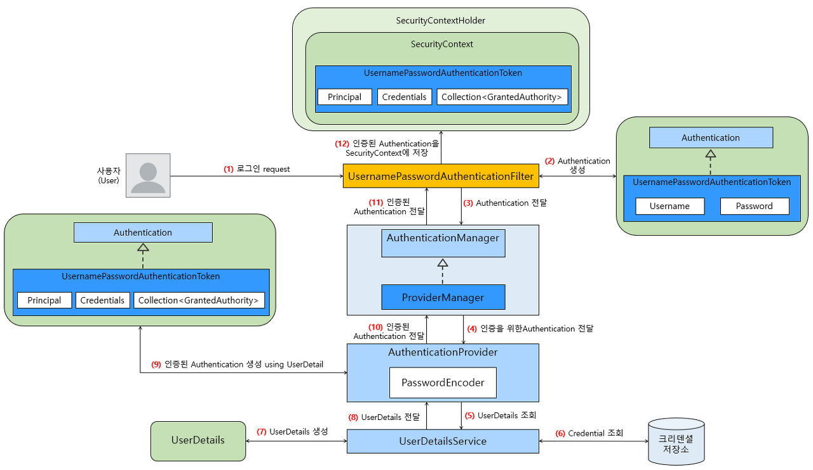
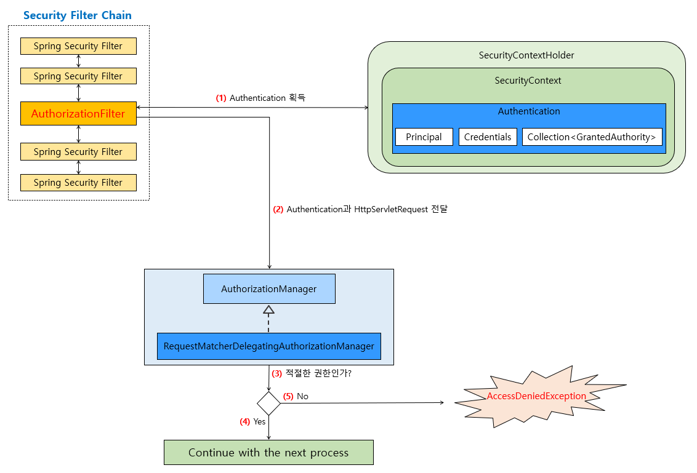
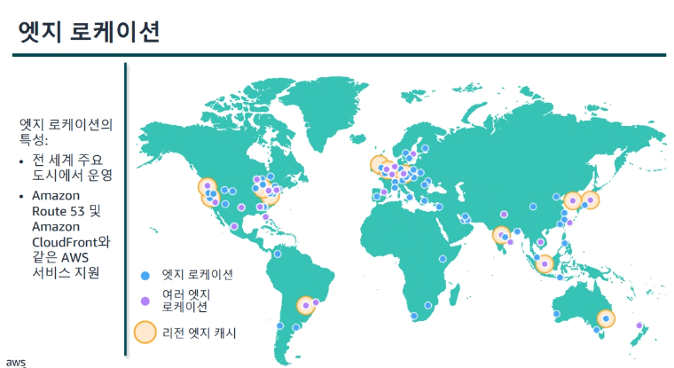
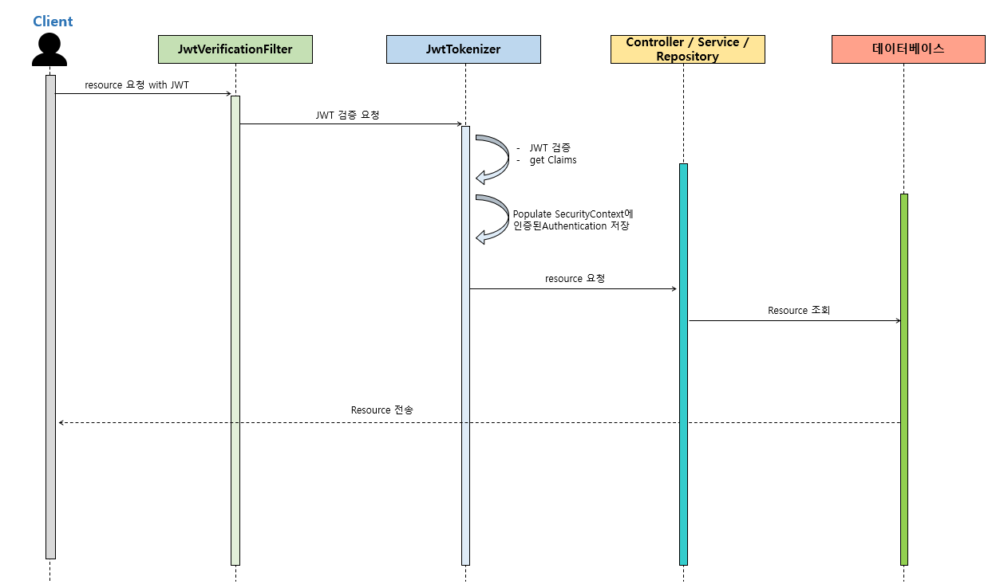

<details>
  <summary>Spring-Security</summary>

### 스프링 시큐리티란

스프링 기반 보안을 (인증, 권한, 인가) 담당하는 스프링 하위 프레임워크.
보안과 관련된 많은 옵션을 제공. (개발 비용 감소)
주로 서블릿 필터와 이들로 구성된 위임 모델 사용.

- 인증 : 검증된 사람인지 확인. (주로 사용자 Request와 동일한 정보가 DB에 있는지 확인)
- 인가 : 인증 확인 이후 요청에 접근할 수 있는지 권한 확인.
- 권한 : 인가 과정에서 사용.

<br/>

### 스프링 시큐리티 특징

- 보안과 관련 된 체계적인 옵션 제공.
- Filter 기반으로 MVC와 분리하여 관리 및 동작.
- 어노테이션을 통한 간단한 설정 가능.
- 기본적으로 세션 & 쿠키 방식. 추가적으로 JWT 방식
- 인증 관리자(UsenamePasswordAuthenticationFilter)와 접근 결정 관리자(FilterSecurityInterceptor)를 통해 리소스(DB) 접근 관리.

<br/>

### UsernamePasswordAuthenticationToken (인증 플로우에서 사용되는 객체)

- 인증 완료 전 OR 인증 완료 후의 정보를 가지는 객체.
- 여러 단계에서 사용되며, 단계 별 사용자 정보를 편하게 주고 받기 위한 객체.
- Authentication (인증용 객체) 상속 받음.
- 크게 3가지 정보를 가지며 다음과 같음.
- Principal(사용자 정보) : 저장소에 저장되어 있는 사용자 정보. (개발자가 클라이언트에게 보내고 싶은 정보만 담은 객체)
- Credential(민감한 정보) : 사용자 검증을 할 때 사용 되는 정보, 저장소에 저장되어 있는 민감한 정보. (대부분 비밀번호)
- List<GrantedAuthority\>(권한 목록) : Principal이 가지고 있는 권한 목록. (각각 ROLE로 작명. ROLE_ADMIN, ROLE_USER 등)

<br>

### 인증 플로우



1. [Client] 로그인 정보 담아 Request.

2. [UsernamePasswordAuthenticationFilter] 클라이언트가 요청한 로그인 정보를 인터셉트. 해당 정보 각각 유효성 검사 후 UseNamePasswordAuthenticationToken 생성. (아직 인증 되지 않은 Token)

3. [UsernamePasswordAuthenticationFilter] AuthenticationManager 인터페이스를 구현한 ProviderManager 호출. (Authentication 전달)

4. [ProviderManager] 실제 사용자인지 확인 하기 위해 AuthenticationProvider 호출. (Authentication 전달)

5. [AuthenticationProvider] 인증 확인을 위해 UserDetailsService 호출. (Authentication 전달)

6. [UserDetailsService] 전달 받은 Authentication 정보 저장소에 있는지 확인. (대부분 ID 조회)

7. [UserDetailsService] 정보가 있는 경우 UserDetails 생성.

8. [UserDetailsService] 생성한 UserDetails AuthenticationProvider에 반환.

9. [AuthenticationProvider] UserDetails Credential과 Authentication Credential 동일 여부 확인. (같은 경우 인증 완료) 인증이 완료되면 UserDetails 이용하여 Principal, Credential, List<GrantedAuthority\> 추출 후 UseNamePasswordAuthenticationToken 생성. (인증 완료된 Token)

10. [AuthenticationProvider] 인증 완료된 객체 ProviderManager 반환.
11. [ProviderManager] 전달 받은 인증 완료된 객체 UsernamePasswordAuthenticationFilter 반환.
12. [UsernamePasswordAuthenticationFilter] 인증 완료된 객체 SecurityContextHolder 안에 있는 SecurityContext에 저장됨. (기본적으로 SecurityContext에 저장된 정보는 SecurityContextPersistenceFilter를 통해 HttpSession에 저장되어 인증 상태 유지 -> Session 방식)

<br/>

### 인가 권한 확인 플로우



1. [AuthorizationFilter] SecurityContext에 저장되어 있는 인증 완료된 객체 획득.
2. [AuthorizationFilter] AuthorizationManager 인터페이스를 구현한 RequestMatcherDelegatingAuthorizationManager 호출. (Authentication, HttpServletRequest 전달)
3. [RequestMatcherDelegatingAuthorizationManager] 확인 결과 적절한 권한을 가졌다면 통과. 아니라면 예외 발생. 해당 에러는 ExceptionTranslationFilter가 처리.

<br>

### 인증 인가 예외 처리

- Security 인증 인가 로직에서 예외가 발생한 경우 처리 방법은 다음과 같음.
- 주의점은 해당 방법들 간 처리 순서가 정해져 있음. 따라서 앞에서 처리할 경우 뒤에 로직은 실행 안될 수 있음. (Filter 형식이기 때문에 순서가 있음)

- 에러를 처리하는 것은 아님. ( 처리)

  #### [AuthenticationEntryPoint]

  - 인증 확인 시점에서 Exception 발생한 경우 도착하게 되는 지점.
  - 어떤 에러가 난지 모르겠다면 여기서 일괄 처리 가능.
  - 주로 로그인 페이지로 리다이렉션하거나 개발자 정의 오류 메시지 반환

  #### [AccessDeniedHandler]

  - 권한 확인 시점에서 Exception 발생할 경우 도착하게 되는 지점.
  - 주로 권한 거부 페이지로 리다이렉션하거나 사용자 정의 오류 메시지 반환.

  #### [ExceptionTranslationFilter]

  - 인증, 인가에서 발생한 예외를 통합 처리하는 지점.
  - 두 방식을 합친 것으로 공통된 처리 방식일 경우 사용.
  - 만약 위의 두 방법이 모두 설정되어 있다면 동작하지 않음.

  #### [Global Exception Handling]

  - 개발자가 직접 예외, 처리 Handler 구현.
  - @ControllerAdvice OR @RestControllerAdvice 사용.
  - 인증, 인가에서 발생한 예외를 개발자가 만든 예외로 대체하여 예외 던짐.
  - 가장 큰 틀에서 Try-Catch로 개발자가 만든 예외를 처리함. 이때, Request에 해당 예외를 저장.
  - 기본적으로 인증, 인가에서 예외가 발생하면 각각 AccessDeniedHandler, EntryPoint를 타게 됨.
  - 이때, Request에서 저장된 예외가 있는지 확인. 만약 존재할 경우 Spring Boot가 기본적으로 가지고 있는 resolver에 예외 처리 위임. 이 경우 Filter에서 예외가 발생 했지만, @ExceptionHandler로 처리가 가능해짐.
  - 장점
    - 사용자가 만든 에러 처리 틀을 이용할 수 있으므로 Security 에러 뿐만 아니라 다른 에러와도 형식을(반환 값 등) 맞출 수 있음. (일관성)
    - 에러 코드를 한 곳에 모와 관리할 수 있음. (중앙 집중화)
    - 프로젝트에 맞는 보안 설계로 만들 수 있음.
  - 단점
    - @ControolerAdvice 사용법을 숙지해야함.
    - 디버깅이 어려움.
    - 보안 설계를 신중하게 설계 해야 함.

<br/>

### 모듈

<details>
  <summary>더보기</summary>

#### [Authentication]

- 현재 접근하는 주체의 정보와 권한을 담음. (인터페이스)

  ```java
      public interface authentication extends Principal, Serializable {
          // 현재 사용자의 권한 목록
          Collection<? extends GrantedAuthority> getAuthorities();

          // credentials (주로 비밀번호)
          Object getCredentials();

          Object getDetails();

          // Principal 객체
          Object getPrincipal();

          // 인증 여부를 가져옴
          boolean isAuthenticated();

          // 인증 여부 설정
          void setAuthenticated(boolean isAuthenticated) throws IllegalArgumentException;

      }
  ```

<br/>

#### [UsernamePasswordAuthenticationToken]

- Authentication을 implements한 AbstractAuthenticationToken의 하위 클래스.
- User의 ID가 Principal 역할을 하고, Password가 Credential의 역할을 함.
- UsernamePasswordAuthenticationToken의 첫 번째 생성자는 인증 전의 객체를 생성하고, 두번째 생성자는 인증이 완료된 객체를 생성함.

  ```java
      public class UsernamePasswordAuthenticationToken extends AbstractAuthenticationToken {
          // 주로 사용자의 ID
          private final Object principal;

          // 주로 사용자의 비밀번호
          private Object credentials;

          // 인증 완료 전의 객체 생성
          public UsernamePasswordAuthenticationToken(Object principal, Object credentials){
              super(null):
              this.principal = principal;
              this.credentials = credentials;
              setAuthenticated(false);
          }

          // 인증 완료 후의 객체 생성
          public UsernamePasswordAuthenticationToken(Object principal, Object credentials, Collection<? extemds GramtedAuthority> authorities) {
              super(authorities);
              this.principal = principal;
              this.credentials = credentials;
              super.setAuthenticated(ture);
          }
      }

      public abstract class AbstractAuthenticationToken implements Authentication, CredentialsContainer {}
  ```

 <br/>

#### [AuthenticationManager]

- 인증 처리를 지시하는 매니저 역할. (인터페이스)
- AuthenticationProvider이 등록되어 있음.

<br/>

#### [ProviderManger]

- AuthenticationManager를 구현한 클래스.
- 인증이 성공적으로 이루어진 후, Crendentials 제거. (인증 완료하면 더이상 필요 없으며, 민감 정보이기 때문에 제거)

<br/>

#### [AuthenticationProvider]

- 인증된 사용자인지 판단하는 역할. (인터페이스)
- 인증 매니저의 지시를 받는 현장 담당자 역할.

<br/>

#### [UserDetails]

- 저장소에 저장된 사용자 정보를 담을 객체.
- UserDetails 인터페이스의 경우 직접 개발한 UserVO 모델에 UserDetails를 implements하여 이를 처리하거나 userDetailsVO에 UserDetails를 implements하여 처리 가능.

  ```java
      public interface UserDetails extends Serializable {
          Collection<? extends GrantedAutority> getAuthorities();
          String getPassword();
          String getUserName();
          boolean isAccountNonExpired();
          boolean isAccountNonLocked();
          boolean isCredentialExpired();
          boolean isEnabled();
      }
  ```

<br/>

#### [UserDetailsService]

- UserDetails 객체를 반환하는 단 하나의 메소드를 가지고 있음. (인터페이스)
- 분리를 위해 UserService를 따로 만들고, UserDetailsService를 구현한 클래스에서 UserService를 호출하여 UserDeails에 넣을 사용자 정보를 가져오는 것이 일반적.

  ```java
      public interface UserDetailService {
          UserDetails loadUserByUsername(String var1) throws UsernameNotFountException;
      }
  ```

<br/>

#### [PasswordEncoding]

- AuthenticationManagerBuilder.userDetailsService().passwordEncoder() 통해 패스워드 암호화에 사용될 PassEncoder 구현체 지정 가능

  ```java
      @Override
      protected void configure(AuthenticationManagerBuilder auth) throws Exception {
          auth.userDetailService(userDetailsService).passwordEncoder(passwordEncoder());
      }

      @Bean
      public PasswordEncoder passwordEncoder(){
          return new BcryptPasswordEncoder();
      }
  ```

<br>

#### [SecurityContextHolder]

- 인증된 객체 정보를 저장하기 위한 객체.

<br/>

#### [SecurityContext]

- 인증된 객체를 보관하는 객체
- SecurityContext를 통해 Authentication 객체를 꺼내올 수 있음.

</details>

<br/>

### SecurityFilterChain


| 필터명 | 설명 |
| ----------------------------------- | -------------------------------------------------------------------------------------------------------------------------- |
| SecurityContextPersistenceFilter | SecurityContext를 로드하고 저장 |
| LogoutFilter | 로그아웃 URL로 지정된 가상 URL에 대한 요청을 감시하고 매칭되는 요청이 있으면 사용자를 로그아웃 시킴 |
| UsenamePasswordAuthenticationFilter | 사용자명과 비밀번호로 이루어진 폼 기반 인증에 사용하는 가상 URL 요청을 감시하고 요청이 있으면 사용자의 인증을 진행 |
| DefaultLogInPageGeneratingFilter | 폼 기반 또는 OpenID 기반 인증에 사용하는 가상 URL에 대한 요청을 감시하고 로그인 폼 기능을 수행하는데 필요한 HTML 생성 |
| BasicAuthenticationFilter | HTTP 기본 인증 헤더를 감시하고 이를 처리 |
| RequestCacheAwareFilter | 이 필터가 호출되는 시점까지 사용자가 아직 인증을 받지 못했다면 요청 관련 인증 토큰에서 사용자가 익명 사용자로 나타나게 됨. |
| SessionManagementFilter | 인증된 주체를 바탕으로 세션 트래킹을 처리해 단일 주체와 관련한 모든 세션들이 트래킹되도록 도움 |
| ExceptionTranslationFilter | 이 필터는 보호된 요청을 처리하는 동안 발생할 수 있는 기대한 예외의 기본 라우팅과 위임을 처리함 |
| FilterSecurityInterceptor | 이 필터는 권한부여와 관련한 결정을 AccessDecisionManager에게 위임해 권한 부여 결정 및 접근 제어 결정을 쉽게 만들어 줌 |

- addFilter() : 해당 필터 실행 후 지점에 필터 추가.
- addFilterbefore() : 해당 필터 실행 전 지점에 필터 추가.
- Security를 적용하기 위해 여러가지 Filter를 상속 받아 로직을 구현함. 이때, 어떤 Filter을 상속 받아야 하는지 해당 표를 보면 됨.
- 해당 그림만으로 설명하긴 힘드므로 실습을 통해서 알아가는 것이 좋음.

### 기타

<details>
  <summary>로그인 이후 사용자 정보 얻는 방법</summary>

1. Bean을 통해 사용자 정보 가져오기

   ```java
   Object principal = SecurityContextHolder.getContext().getAuthentication().getPrincipal();
   UserDetails userDetails = (UserDetails)principal;
   String username = principal.getUsername();
   String password = principal.getPassword();
   ```

2. controller에서 매개변수로 입력 받기

   ```java
   @Controller
   public class UserController{}
     @GetMapping
     public String getMyInfo(Authentication authentication){
       JwtAuthenticationToken authentication = (JwtAuthenticationToken) authentication;
       User user = (User)authentication.getDetails();
       return user.toString();
     }
   }
   ```

   - Authentication 또는 Principal를 매개 변수 받을 경우 SpringSecurityContext에 있는 정보를 가져온다.

3. @AuthenticationPrincipal 로 가져오기
   ```java
   @Controller
   public class SecurityController
   {
     @GetMapping("/messages/inbox")
       public ModelAndView currentUserName(@AuthenticationPrincipal CustomUser customUser)
       {
         String username = customUser.getUsername();
           // .. find messages for this user and return them ...
       }
   }
   ```
   - SpringSecurity 3.2 부터 사용 가능.

</details>
</details>

---

<details>
  <summary>JWT</summary>

### JWT란

- JSON 객체를 통해 안정하게 정보를 전송할 수 있는 웹 표준.
- '.' 구분자로 세 부분으로 구분되어 있음.
- 세션이 유지 되지않는 다중 서버 환경에서 로그인 유지 가능.
  

  #### header

  ```json
  {
    "typ": "JWT", // JWT 타입
    "alg": "HS256" // JWT에서 사용되는 알고리즘
  }
  ```

  #### payload

  ```json
  {
    "sub": "123456789", // 비공개 클레임
    "userId": "Jone Doe", // 비공개 클레임
    "https://github.comn/away0419": true // 공개 클레임
  }
  ```

  - 클레임이란 key와 value가 한쌍으로 이루어진 형태
    - "sub" : "123456789" 가 하나의 클레임임.
  - 등록 클레임은 필수로 사용되는 정보(데이터)는 아니지만 JWT가 기본적으로 가지는 정의된 key-value을 이용하여 Token 생성 정보를 만들 때 사용함.
    - iss : 토클 발급자
    - sub : 토큰 제목
    - aud : 토큰 대상자
    - exp : 토큰 만료 시간
    - nbf : 토큰 활성 날짜
    - iat : 토큰 발급 시간
    - jti : JWT 고유 식별자
  - 공개 클레임은 말 그대로 공개용 정보를 뜻하며 key에 URI 포맷을 이용함.
    - "https://github.comn/away0419" : true
  - 비공개 클레임은 실제 사용되는 정보(데이터)임.
    - "userId" : "away0419"
  - 이러한 클레임들이 모여 인코딩 되어 JSON payload가 됨.

  #### signature

  - 인코딩된 헤더(Header)와 인코딩된 페이로드(payload), 비밀 키(Secret)와 알고리즘을 기반으로 백엔드에서 발급됨.

<br>

### 로그인 후 회원 검증 방식

- 세션

  - 사용자 정보를 서버에(SecurityContext) 저장. 이와 연결 되는 세션 ID 발급.
  - 클라이언트는 서버에 요청을 보낼 때 세션 ID를 Header에 담아 보냄.
  - 세션 ID가 탈취 될 위험성이 있으며 서버가 세션 저장소를 필요로 하기 때문에 추가적인 저장 공간이 필요.
  - 서버에서 사용자를 관리하기 때문에 서버에 부담을 줄 수 있음.

    

<br/>

- JWT (Access Token & Refresh Token)

  - 인증에 필요한 정보를 암호화하여 만든 토큰을 활용한 방법.
  - 사용자 인증 완료 시, Access Token 발급 후 HttpHeader에 담아 응답.
  - 이후, 클라이언트는 Access Token을 Header에 담아 요청.
  - 권한이 필요한 요청일 경우 Access Token에 있는 사용자 권한 확인.
    - 확인 결과 권한 있을 경우 요청에 대한 적절히 응답.
    - 만약, 권한이 없다면 권한 없음 응답.
    - 만약, Access Token이 유효하지 않다면 에러 응답.
  - 기본적으로 DB 접근 과정이 로그인할 때만 있어 효율적.
  - Refresh Token 추가 시 빨간색 과정 추가.

    - Access Token 기간 만료 시 재발급 하는 용도.
    - 사용자 정보를 담고 있기 보단, 기간 만료 등 공개 클레임만 가짐.

    

   <br/>

### Security + JWT 프로세스

- JWT는 크게 두가지 방법을 사용함.

  - 로그인 결과 값을 반환 하는 Controller에서 JWT를 발급.
  - Security 로그인 성공 시 실행되는 로직에서 JWT를 발급.
  - Security 사용 시 후자 선택.

- 로그인(인증) 프로세스
  

  - 기본적인 흐름은 Security 로그인 플로우와 동일.
  - JwtAuthenticationFilter에서(UsernamePasswordAuthenicationFilter) Response에 Token 추가 로직 구현한 것.
  - 따라서 Security의 플로우를 확인하며 해당 프로세스 그림을 보면 이해하기 쉬움.

- 자격 검증 프로세스
  
  - 사용자가 Header에 보낸 Token을 JwtVerificationFilter에서 검증.
  - 검증이 완료되었다면 인증된 객체를 만들어 SecurityContext에 저장. 이를 통해 이후 단계에서 문제 없이 통과 가능. (만약 저장하지 않을 경우, 다음 단계에서 인증된 객체를 찾지 못하여 통과 못할 수 있음)
  - 이때, SecurityContext에 저장된 정보는 모든 단계 통과 후 SecurityContextPersistenceFilter가 삭제하여 유지 되지 않도록 만듬. (SecurityConfig에서 세션을 stateless로 설정 해야함)

### Refresh Token 생긴 이유와 흐름, 전략

- Access Token의 만료 시간이 클수록 탈취 될 가능성이 높음. 반대로 만료 시간이 작으면 자주 로그아웃 됨. 이를 해결하고자 나온 Token.
- 흐름은 다음과 같음.
  - 사용자가 요청 했을 때, Access Token 기간 만료시 기간 만료 에러 응답.
  - 사용자가 에러 코드 확인 후 Refresh Token, Access Token 함께 보내 Access Token 재발급 요청
  - 서버에서 Refresh Token 확인 결과 유효하다면, Access Token 재발급.
    - 만약, Refresh Token 남은 만료 시간이 1주일 이하라면, RefreshToken 함께 재발급.
  - 사용자는 재발급 받은 Access Token으로 다시 요청.
- Refresh Token를 사용할 경우 추가적인 요청/응답이 발생한다는 단점이 있음.
  - 또한, Refresh Token 유효성 검사를 위해 DB에 Refresh Token을 저장할 때가 많음.
  - 이 경우 Session과 차이 없을 수 있으나, Redis Cache 이용하여 최소화함.
- Refresh Token 탈취 가능성 있음. 이를 막고자 다음과 같은 전략이 생김.

  #### RTR(Refresh Token Rotation) 전략

  - Refresh Token 1회용 전략.
  - Refresh Token 1회라도 사용되면 Refresh Token을 함께 재발급 하는 전략.
    - DB를 사용하는게 일반적임. (JWT 강점 약화)
    - Redis Cache로 DB 연결 최소화.
  - Refresh 탈취 당하더라도, 한번 사용된 시점에 값이 바뀌어 DB에 저장됨.
    - 다음 Refresh 요청 시 DB에 저장된 Refresh 값과 다르다면 연결 거부.
    - 이후 DB에 저장된 Refresh 값을 임의로 변경.
    - 따라서 재로그인 해야 서비스 이용 가능.
    - 이때, 다시 로그인한 사용자에게 비정상 접근을 알려준다면 Best.
  - XSS 공격에 취약.

  #### http-only 적용 전략

  - http-only 적용한 쿠키에 Refresh Token 담아 넘기는 전략.
    - 쿠키도 원래 헤더에 저장됨.
    - 쿠키 설정에 HTTP-ONLY를 적용하는 것.
    - 설정할 경우 해당 쿠키는 JS에서 접근 불가. (XSS 공격 방어, 개발자 모드로는 확인 할 수 있음)
  - csrf 공격 취약함.

  #### Sliding Sessions 전략

  - Access Token 기간 만료 전 요청이 들어온 경우 해당 Access Token을 재발급 하여 응답 값과 함께 보냄.
  - Access Token 기간 만료 시간 보다 오래 걸리는 작업 도중 기간 만료가 발생하는 불상사를 줄일 수 있음.
  - 잦은 Access Token 발급으로 비용 증가.

  #### Refresh Token의 한계점

  - 보안에 취약 하다는 평가 존재.
  - 탈취 된 Access Token인지 확인 불가능.
  - Refresh Token 탈취 된 경우 Access Token 재발급 가능하여 Access Token 탈취 된 것과 똑같음.

### 기타

<details>
    <summary>Authorization Header</summary>

- 일반적으로 토큰은 Authorization Header에 담아서 서버에 전송함.
- Authorization: `<type>` `<credentials>` 형식으로 우리가 흔히 사용하는 bearer는 type 형식에 해당함.
- type에는 여러 종류가 있음. (토큰 타입과는 별개)
  - basic : 아이디와 비밀번호를 Base64로 인코딩한 값 사용
  - bearer : JWT 또는 OAuth에 대한 토큰 사용
  - digest : 서버는 난수를, 클라이언트는 사용자 정보와 nonce를 포함하는 해시값 사용
  - HOBA : 전자 서명 사용
  - Mutual : 암호를 이용한 서버-클라이언트 상호 인증
  - AWS4-HMAC-SHA256 : AWS 전자 서명 사용
    </details>
  </details>

---
