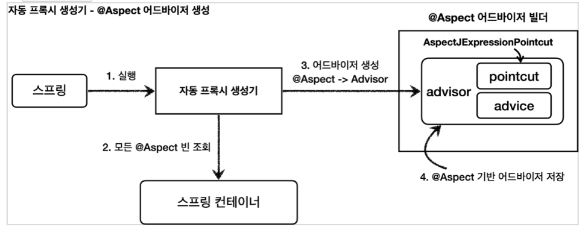
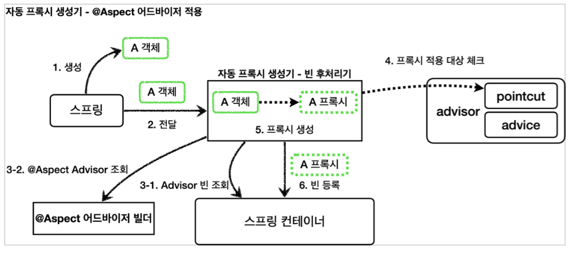
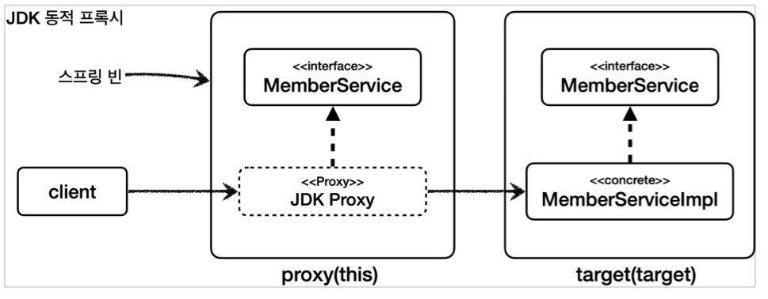

> ## Spring AOP 동작 과정

- @Aspect가 있을 경우 Advisor로 변환해서 @Aspect Advisor 빌더 내부에 저장하는 작업을 수행함.
  

- 이후 다음 과정을 통해 Advisor 로직을 넣음.
  

1. 스프링 빈 대상이 되는 객체를 생성. (Component Scan 대상)
2. 생성된 객체를 빈 저장소에 등록하기 직전에 빈 후처리기에 전달.
3. 빈 후처리기에서 해당 빈의 프록시를 만들어 이를 @Aspect Advisor 빌더 내부에 전달.
4. 빌더 내부에 저장된 모든 Advisor 조회하여 포인트컷의 정보와 동일한 Advisor를 찾음.
   - Advisor를 찾은 경우 프록시를 생성하고 해당 프록시를 빈 저장소에 반환.
   - 못찾은 경우 전달받은 프록시를 그대로 빈 저장소에 반환.
5. 빈 저장소는 반환 받은 프록시로 스프링 컨테이너에 빈 등록.

<br/>
<br/>

> ## Spring AOP 사용 시 주의사항

### Bean 등록

- @Aspect는 Advisor를 쉽게 만들 수 있도록 도와주는 역할을 하는 것이지 컴포넌트 스캔이 되는 것은 아님. 따라서 반드시 빈 등록을 해야함.

<br/>

### 프록시 내부 호출

```java
@Slf4j
@Component
public class CallService {

   @LogAOP
    public void external() {
        log.info("call external");
        internal(); //내부 메서드 호출(this.internal())
    }

    @LogAOP
    public void internal() {
        log.info("call internal");
    }

}
```


- 빈 컨테이너에는 CallServic() 프록시가 있음.
- external(), internal()을 호출하면 해당 프록시를 통해 호출 됨.
- external(), internal()을 각각 호출하면 둘 다 적용이 됨. 그러나 external() 안의 internal()은 AOP가 적용되지 않음.
- 대안 방법으로는 구조 변경, 지연 조회 등이 있음. (지연 조회는 ObjectProvider, ApplicationContext를 사용)

<br/>

### JDK 다이나믹 프록시 VS CGLIB 프록시



- MemberServiceImpl 대상으로 프록시 생성할 경우 MemberService 기반으로 프록시 생성하여 빈 등록.
- 해당 프록시는 MemberServiceImpl 타입 캐스팅 불가능.
  - DI 시 문제 발생.

<br/>


- MemberServiceImpl 대상으로 프록시 생성할 경우 MemberServiceImpl 기반으로 프록시 생성하여 빈 등록.
- 해당 프록시는 MemberService 타입 캐스팅 가능.
  - DI 시 문제 발생 없음.
- CGLIB는 다양한 문제가 있음.
  - 대상 클래스 기본 생성자 필수.
    - 클래스를 상속받아 구현되기 때문에 자식 생성자에서 부모 클래스의 생성자를 반드시 호출 해야 함.
  - 부모 생성자 2번 호출.
    - target 객체를 생성할 때 1번.
    - 프록시 객체를 생성할 때 부모 생성자 호출 1번.
  - final 키워드를 클래스, 메서드에 사용 불가.
    - 상속 문제가 있지만, 일반적으로 웹 개발에서는 final 키워드 잘 사용하지 않아서 특별히 문제가 되진 않음.
- 스프링은 해당 문제를 해결하고 GCLIB 사용을 채택함.
  - objenesis 라이브러리로 기본 생성자 없이 객체 생성.
  - target 생성할 때 생성자 호출 1번, objenesis 라이브러리로 프록시 객체 생성할 때는 생성자 호출 없이 객체 생성.

<br/>
<br/>

> ## 어노테이션 및 메소드 정리

<details>
  <summary>@Aspect</summary>

- 컴포넌트 스캔 대상이 될 수 있음. -> 실제 스캔 대상에 포함 되는 것을 보장 하지는 않기 때문에 추가 설정 필요.
  - @Component 함께 적용. (첫번째 방법)
  - SprinbBoot에 @Aspect를 컴포넌트 스캔 대상 설정하기. (두번째 방법)
    - @ComponentScan(value = "aspect", includeFilters = @ComponentScan.Filter(value = Aspect.class))
</details>

<details>
  <summary>Advice 순서 지정</summary>

- 주어진 포인트 컷에서 언제 실행될지 어노테이션을 통해 지정.
- 동일한 포인트 컷에 여러 Advice가 있는 경우 다음과 같이 실행됨.
  - Around -> Before -> AfterThrowing -> AfterReturning -> After -> Around
  - 만약 순서를 지정하고 싶다면 @Order(우선순위)를 사용.


- @Around
  - 뒤에 나올 4가지 상태를 모두 포함하며 원하는 시점에 원하는 작업 가능.
  - 메서드 호출 전후 작업 명시 가능.
  - 조인 포인트 실행 여부 선택 가능.
  - 반환 값 자체 조작 가능.
  - 예외 자체를 조작 가능.
  - 조인 포인트를 여러번 실행 가능.


- @Before
  - 타겟 실행 전에 끼어들어 작업 수행.
  - 메소드 제어, 데이터 가공 불가능.


- @After
  - 타겟 실행 후에 끼어들어 작업 수행.
  - 메소드 제어, 데이터 가공 불가능.


- @AfterReturning
  - 타겟이 정상적으로 실행 완료된 경우 끼어들어 작업 수행.
  - 리턴 값 확인 가능하나 메소드 제어, 데이터 가공 불가능.


- @AfterThrowable
  - 타겟이 예외를 발생시킨 경우 끼어들어 작업 수행.
  - 예외 값 확인 가능하나 메소드 제어, 데이터 가공 불가능.
</details>


<details>
  <summary>PointCut 지정</summary>
  
- AOP 실행 지점을 표현식으로 알려주는 방법.
- 여러 Point Cut 사용하고 싶다면 ||, && 등으로 조합 가능.


- execution(\* \* \*.\*.\*(..))
  - 기본 표현식으로 @Around("execution()") 형태로 사용함.
  - \* : 접근 제한자.
  - \* : 반환 타입.
  - \*.\*.\* : 지정할 메소드의 패지지 경로와 메소드명.
  - (..) : 해당 메소드의 매개 변수.


- within(\* \* \*.\*.\*(..))
  - @Around("within()") 형태로 사용함.
  - 타입이 정확하게 맞아야 동작.
  - 따라서, 상위 타입으로 하위 타입 매칭 불가능. (service로 설정할 경우 serviceimpl에서 동작 안함)


- args(\*)
  - args 단독으로 사용하면 안됨.
  - @Around(다른 표현식 && "args()") 형태로 사용함.
  - 파라미터 타입이 부모, 하위 일 경우에도 동작.
  - \* : 파라미터 타입.


- @target(메소드 패키지명.메소드명)
  - 단독으로 사용 불가능
  - @Around(다른 표현식 && "target()") 형태로 사용함.
  - 자신의 클래스와 자신의 모든 부모 클래스의 모든 메소드에서 동작.


- @within(메소드 패키지명.메소드명)
  - 단독으로 사용 불가능
  - @Around(다른 표현식 && "within()") 형태로 사용.
  - 자신이 포함된 클래스의 모든 메소드에서 동작.


- @annotation
  - @Around("@annotation(어노테이션 패키지명.클래스이름)") 형태로 사용.
  - 메소드가 주어진 어노테이션을 가지고 있을 경우 동작.


- bean()
  - 스프링 빈 중 주어진 이름의 조건과 맞을 경우 동작.
  - \*Repository 로 주어진 경우 Repository로 끝나는 빈 모두 적용.


- this, target
  - 스프링에서 AOP를 적용하면 실제 대상 객체 대신에 프록시가 빈으로 등록되는데 이를 구분 짓고자 사.용
  - this : 스프링 빈 객체 (프록시)를 대상으로 매칭.
  - target : 실제 객체를 대상으로 매칭.
  - 적용 타입 하나를 정확하게 지정해야함.
  - 부모 타입 허용.

</details>

<details>
  <summary>@EnableAspectJAutoProxy</summary>

- 스프링 컨텍스트 내에서 AspectJ AOP 프레임워크를 사용할 수 있도록 하는 어노테이션.
- Spring Boot는 적용하지 않아도 AspectJ AOP 프레임 워크를 사용 가능.
</details>

<details>
  <summary>JoinPoint 메소드</summary>

| 메소드              | 설명                                         |
| ------------------- | -------------------------------------------- |
| getArgs()           | 대상 메소드의 인자 목록을 반환               |
| getSignature()      | 대상 메소드의 정보를 반환                    |
| getSourceLocation() | 대상 메소드가 선언된 위치를 반환             |
| getKind()           | Advice 종류 반환                             |
| getStaticPart()     | Advice가 실행될 JoinPoint의 정적 정보를 반환 |
| getThis()           | 대상 객체를 반환                             |
| getTarget()         | 대상 객체를 반환                             |
| toString()          | JoinPoint의 정보를 문자열로 반환             |
| toShortString()     | JoinPoint의 간단한 정보를 문자열로 반환      |
| toLongString()      | JoinPoint의 자세한 정보를 문자열로 반환      |

</details>

<details>
  <summary>공통 포인트 컷 사용할 경우</summary>

- 공통 포인트 컷 사용할 경우 메소드로 만들어 사용.


```java
// 공통 포인트 컷
@Pointcut("execution(* com.example.springboot_java.domain.CalculateService(..))")
private void pointCut() {
}

@Pointcut("@annotation(com.example.springboot_java.annotation.LogAOP)")
private void annotationPointCut() {
}

@Around("pointCut()")
public void logAround(JoinPoint joinPoint) {
    log.info("AOP Around Execution : " + joinPoint.getSignature().getName());
}
```
</details>

<br/>
<br/>

> ## 의존성 추가

<details>
  <summary>gradle</summary>

```gradlew
dependencies {
    implementation('org.springframework.boot:spring-boot-starter-aop')
}
```
</details>

<br/>
<br/>

> ## Aspect

<details>
  <summary>LogAOP</summary>

- custom annotation.

  ```java
  package com.example.springboot_java.annotation;
  
  import java.lang.annotation.ElementType;
  import java.lang.annotation.Retention;
  import java.lang.annotation.RetentionPolicy;
  import java.lang.annotation.Target;
  
  @Target({ElementType.METHOD})
  @Retention(RetentionPolicy.RUNTIME)
  public @interface LogAOP {
  }
  ```

</details>

<details>
  <summary>LogSpringAOP</summary>

- AOP 등록.
- 실행 시점 설정. 

  ```java
  package com.example.springboot_java.aop;
  
  import lombok.extern.slf4j.Slf4j;
  import org.aspectj.lang.JoinPoint;
  import org.aspectj.lang.annotation.*;
  import org.springframework.context.annotation.Bean;
  import org.springframework.stereotype.Component;
  
  @Aspect
  @Slf4j
  @Component
  public class LogSpringAOP {
  
  //     공통 포인트 컷
      @Pointcut("execution(* com.example.springboot_java.domain.CalculateService.doAdd(..))")
      public void pointCut() {}
  
      @Pointcut("@annotation(com.example.springboot_java.annotation.LogAOP)")
      public void annotationPointCut() {}
  
      @Before("pointCut()")
      public void logBefore(JoinPoint joinPoint) {
          log.debug("AOP Before Execution : " + joinPoint.getSignature().getName());
      }
  
      @Before("annotationPointCut()")
      public void logAnnotationBefore(JoinPoint joinPoint) {
          log.info("AOP Before Annotation : " + joinPoint.getSignature().getName());
      }
  
      @After("pointCut()")
      public void logAfter(JoinPoint joinPoint) {
          log.debug("AOP After Execution : " + joinPoint.getSignature().getName());
      }
  
      @AfterReturning("pointCut()")
      public void logAfterReturning(JoinPoint joinPoint) {
          log.debug("AOP AfterReturning Execution : " + joinPoint.getSignature().getName());
      }
  
  
      @AfterThrowing("pointCut()")
      public void logAThrowing(JoinPoint joinPoint) {
          log.debug("AOP AfterThrowing Execution : " + joinPoint.getSignature().getName());
      }
  }
  ```
</details>

<details>
  <summary>CalculateService</summary>

- JDK 동적 프록시의 경우 interface 필요.
- 최신 spring boot의 경우 기본적으로 CGLIB 프록시를 사용하기 때문에 interface 작성 안해도 됨.

  ```java
  package com.example.springboot_java.domain;
  
  import com.example.springboot_java.annotation.LogAOP;
  
  public interface CalculateService {
      public Integer doAdd(String str1, String str2) throws Exception;
  
      public Integer doMinus(String str1, String str2) throws Exception;
  }
  ```

</details>

<details>
  <summary>CalculateServiceImpl</summary>

- custom annotation 사용.

  ```java
  package com.example.springboot_java.domain;
  
  import com.example.springboot_java.annotation.LogAOP;
  import lombok.RequiredArgsConstructor;
  import lombok.extern.slf4j.Slf4j;
  import org.springframework.stereotype.Service;
  
  @Service
  @Slf4j
  public class CalculateServiceImpl implements CalculateService {
  
      @Override
      public Integer doAdd(String str1, String str2) throws Exception {
          return Integer.parseInt(str1) + Integer.parseInt(str2);
      }
  
      @LogAOP
      @Override
      public Integer doMinus(String str1, String str2) throws Exception {
          return Integer.parseInt(str1) - Integer.parseInt(str2);
      }
  
  }
  ```

</details>

<details>
  <summary>Contoller</summary>

- api 요청하여 aop 동작 하는지 테스트.

  ```java
  package com.example.springboot_java.domain;
  
  import com.example.springboot_java.annotation.LogAOP;
  import lombok.RequiredArgsConstructor;
  import lombok.extern.slf4j.Slf4j;
  import org.springframework.web.bind.annotation.GetMapping;
  import org.springframework.web.bind.annotation.PostMapping;
  import org.springframework.web.bind.annotation.RequestBody;
  import org.springframework.web.bind.annotation.RestController;
  
  import java.util.Map;
  
  @RestController
  @RequiredArgsConstructor
  @Slf4j
  public class Contoller {
      private final CalculateService calculateService;
  
      @PostMapping("/add")
      public int add(@RequestBody Map<String,String> map) throws Exception {
          log.info("add");
          return calculateService.doAdd(map.get("str1"), map.get("str2"));
      }
  
      @PostMapping("/minus")
      public int minus(@RequestBody Map<String,String> map) throws Exception {
          log.info("minus");
          return calculateService.doMinus(map.get("str1"), map.get("str2"));
      }
  }
  ```
</details>

