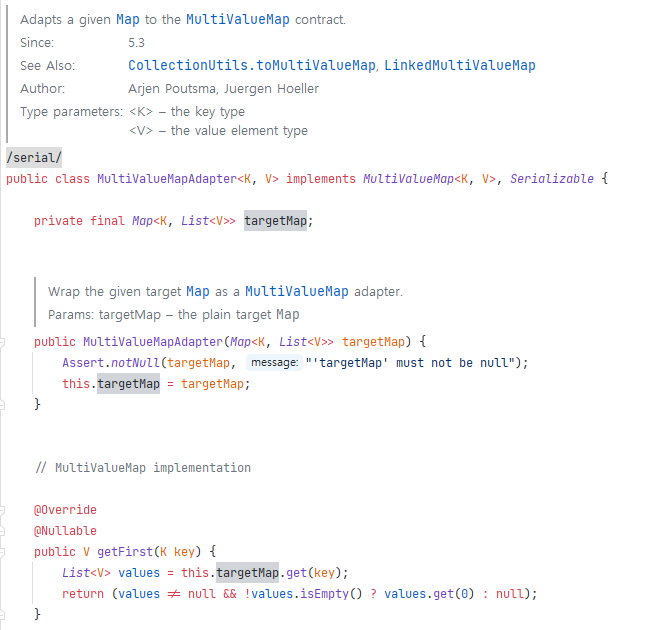

> ## 싱글톤 패턴 (생성)

- 스프링에서 Bean을 생성할 때, 싱글톤 패턴을 사용함.
- 스프링 싱글톤은 스프링 컨테이너에 (BeanFactory/ApplicationContext) 의해 구현됨.
- 인스턴스 생성 시점은 컨테이너에 따라 다름.
  - BeanFactory : 최초 호출 시점. (Lazy Loading)
  - ApplicationContext : 최초 실행 시점. (Eager Loading)
  - 기본적으로 ApplicationContext를 사용하므로 최초 실행시 생성 된다 생각하면 될 듯 함.
  - 만약 ApplicationContext 사용 할 때 특정 컴포넌트를 Lazy Loading을 하고 싶다면 @Lazy 사용하면 됨.
- 하나의 인스턴스이므로 해당 인스턴스의 변수를 수정하면 다른 서비스에서도 모두 바뀌는 당연한 사실을 잊지 않게 조심 해야 함.

<br/>
<br/>

> ## Factory Method (생성)

- 싱글톤 패턴이 팩토리 메소드 패턴을 사용하므로 Bean 등록에 팩토리 메소드 패턴이 사용된다 볼 수 있음.


<br/>
<br/>

> ## Abstract Factory (생성)

- FactoryBean에서 사용하고 있음. 스프링 구문으로 생성 및 관리할 수 없는 객체를 Bean으로 활용할 수 있게끔 어댑터 역할을 함.
  - ex) 싱글톤으로 처리된 객체를 Bean으로 활용하고 싶은경우
- Hibernate 프레임워크의 org.hibernate.cfg.Configuration 클래스에서 사용.

<br/>
<br/>

> ## Static Factory Method (생성)

<details>
  <summary>롬복을 이용한 방법</summary>

```java
package com.example.jspring.staticFactoryMethod;

import lombok.RequiredArgsConstructor;

@RequiredArgsConstructor(staticName = "of")
public class Product {
    private Long id;
    private String name;
}
```
</details>


<br/>
<br/>

> ## Enum Factory Method (생성)

- Spring Security에서 OAuth2를 이용할 때 사용한 경험이 있음.
  - OAuth2 서비스 별 객체가 다른데 이를 생성할 때 사용함.

<br/>
<br/>

> ## Dynamic Factory (생성)

- AOP 로깅 작업 시 비슷하게 사용한 경험이 있음.
  - 객체 생성은 아니고 타입별 로깅 처리를 위해 Reflection API를 이용함.

<br/>
<br/>

> ## Builder (생성)
- lombok의 @Builder에서 사용됨.

<br/>
<br/>

> ## Prototype (생성)
- ModelMapper 라이브러리에서 사용함.
  - 자바의 리플렉션을 이용해 구현한 라이브러리.
  - 명확하게 프로토타입 패턴이라 볼 수 는 없음.

<br/>
<br/>

> ## Adapter (구조)

<details>
  <summary>MultiValueMap </summary>


</details>

<br/>
<br/>

> ## Bridge (구조)

- @Slf4j 에서 사용함.

<br/>
<br/>

> ## Composite (구조)

- ApplicationContext에서 BeanFactory 인스턴스를 트리 구조로 제공함. 즉, ApplicationContext는 컴포지트 패턴이 적용되어 있음.

<br/>
<br/>

> ## Decorator (구조)

- HttpServletRequestWrapper / HttpServletResponseWrapper
  - httpServletRequest 부가적인 기능을 추가하여 확장 사용 가능.
  - wrapper로 만들고 httpServletRequest 담아 보내면 이후 Filter는 항상 해당 wrapper 거쳐서 요청 처리 됨.