> ## Spring Batch란

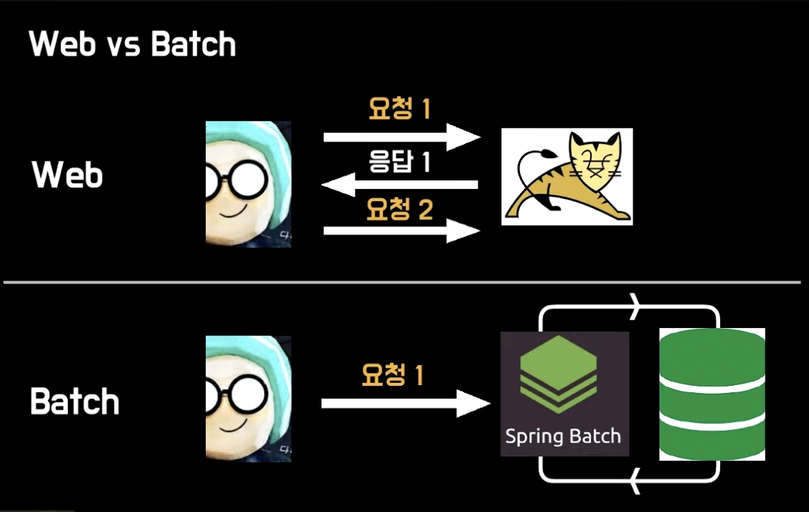

- 일련의 작업을 정해진 로직으로 수행하는 것. (일괄처리)
- 대용량 레코드 처리에 필수적인 기능을 제공함.
  - ex) 로깅/추적, 트랜잭션 관리, 작업 처리 통계, 작업 재시작, 건너뛰기, 리소스 관리
- 최적화 및 파티셔닝 기술을 통해 대용량 및 고성능 배치작업을 가능하게 하는 고급 기술 서비스 및 기능 제공.
- 배치가 실패하여 작업 재시작할 경우 실패한 지점부터 실행함.
- 중복 실행을 막기 위해 성공 이력이 있는 배치는 동일한 파라미터로 실행 시 예외 발생함.
- Scheduler & Quartz -> Batch Job 실행 시키기 위한 용도.
- Spring Batch는 Scheduler가 아님. Batch Job 관리 용도.
  - 배치는 대량의 데이터를 일괄적으로 처리하는 것.
  - 스케줄링은 특정 주기마다 자동으로 돌아가게 해주는 것.

<br/>
<br/>

> ## Spring Batch 특징

- 대용량 데이터 처리.
- 트랜잭션 관리.
- 재시도 기능.

<br/>
<br/>

> ## Spring Batch 구성


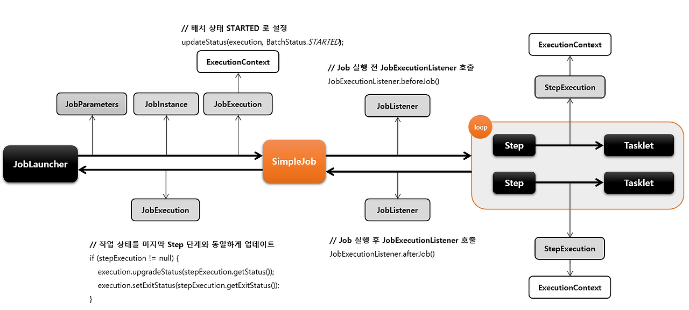

<details>
    <summary>Job</summary>

- 배치 처리 과정을 하나의 단위로 만들어 놓은 객체.
- 배치 처리 과정에 있어 전체 계층 최상단에 위치.
- SimpleJob (순차적으로 step 실행 시키는 job)
- FlowJob (특정한 조건과 흐름에 따라 Step 구성하여 실행 시키는 job)

  

</details>

<details>
    <summary>JobInstance</summary>

- Job 실행 될 때 생성되는 하나의 Job 논리 실행 단위이며, Job의 상태정보를 가짐.
- Job 실행 시점이 다르므로 Job 실행을 구분해야함.
- DB에서 저장된 캐시 ((Job + JobParameter)해싱) 확인 후 기존 캐시된 instance 없으면 새로 만듬.
- 기본적으로 SpringBoot는 job을 모두 실행함. 설정을 통해 ApplicationRunner 구현체를 통해 실행할 수 있도록 하기. (spring.batch.job.enabled = false)
- </details>

<details>
    <summary>JobParameters</summary>

- JobInstance 구별 역할 및 JobInstance에 보내는 매개변수 역할.
- String, Double, Long, Date 4가지 형식만 지원함.
- 생성 및 바인딩 방법.
  - 앱 실행시 주입 (Java -jar LogBatch.jar requestDate=20210101)
  - 코드로 생성 (JobParameterBuilder, DefaultJobParametersConvertor)
  - SpEL 이용 (@Value("#{jobParameter[requestDate]}"), @JobScope, @StepScope)
- Step에서 사용가능.

</details>

<details>
    <summary>JobExecution</summary>

- JobInstance 실행 결과 상태, 시작시간, 종료시간, 생성시간 등의 정보를 담고 있음.
- FAILED, COMPLETED 등 실행 결과 상태를 가지며, COMPLETED는 실행 완료로 간주되어 재실행 불가능. FAILED는 재실행 가능. 즉, 하나의 JobInstance 실행 결과가 COMPLETED가 될 때까지 JobInstance 재실행 가능.
- 캐시된 JobInstance가 있는 경우, Failed 경우에만 동일한 JobInstance 실행 가능.

  
  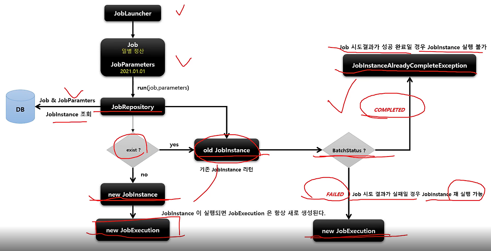

</details>

<details>
    <summary>Step</summary>

- Job의 배치처리를 정의하고 컨트롤하는데 필요한 모든 정보를 가지고 있는 도메인 객체.
- 배치작업을 어떻게 구성하고 실행할 것인지 Job의 세부작업을 Task 기반으로 설정하고 명세한 객체.
- Job은 최소 1개 이상의 step을 가져야함.
- 기본 구현체
  - TaskletStep (가장 기본이 되는 클래스. Tasklet 타입의 구현체 제어)
  - PartitionStep (멀티스레드 방식으로 Step을 여러개로 분리해서 실행)
  - JobStep (Step 내에서 Job 실행. job->step->job->step)
  - FlowStep (Step 안에서 Flow 실행)
- 기본적으로 Job은 여러 Step으로 구성되며, 각 Step은 실제 해야할 일들이 정의되어 있음.

  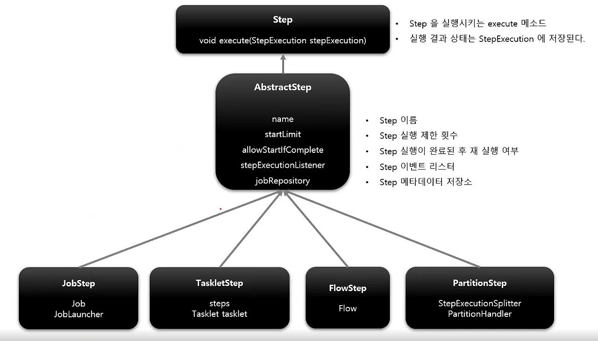

</details>

<details>
    <summary>StepExecution</summary>

- Step 실행 시도를 의미하며 실행 중 발생한 정도들을 저장하는 객체.
- Step의 시작, 종료, 상태 등의 정보, JobExecution에 저장되는 정보 외에 Read Count, Write Count, Commit Count, Skip Count 등의 정보를 가짐.
- Job이 재실행 되더라도 이미 성공한 Step은 재실행하지 않으며 실패한 Step부터 실행됨.
- Job 하나에 여러 Step이 있을 때, 실패한 Step 이후의 Step은 실행 되지 않으므로 실패 이후의 Step은 StepExecution 생성 안됨.
- StepExecution 하나라도 실패한다면 JobExecution 실패함.

  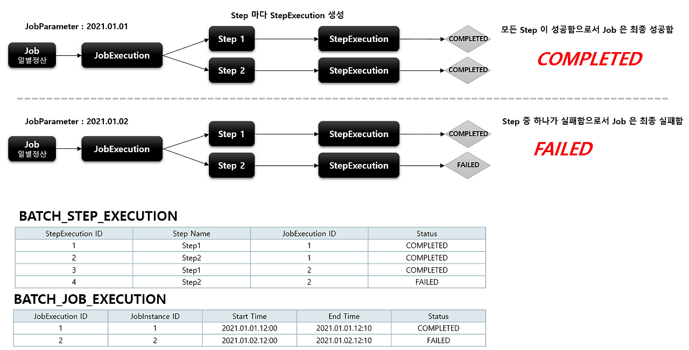

</details>

<details>
  <summary>StepContribution</summary>

- 청크 프로세스의 변경사항을 버퍼링 한 후 StepExecution 업데이트하는 도메인 객체.
- 청크 커밋 직전 StepExecution의 apply 메서드를 호출하여 상태를 업데이트 함.

  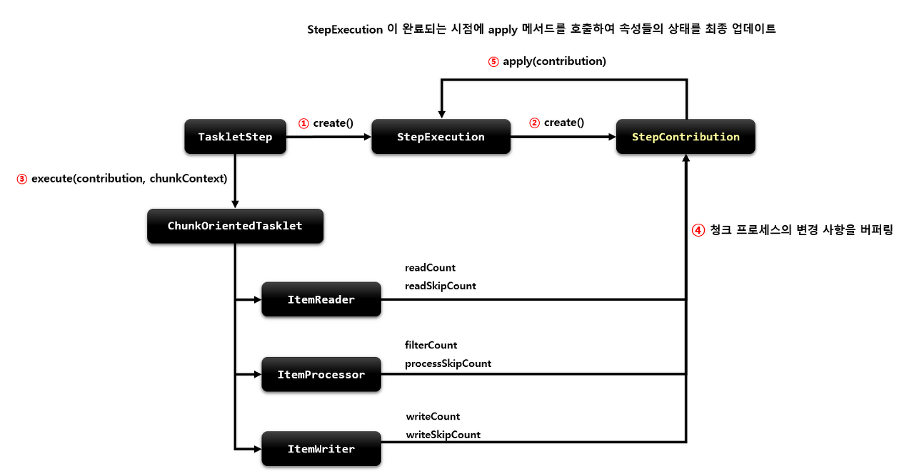

</details>

<details>
    <summary>ExecutionContext</summary>

- 키 값으로 된 컬렉션으로 StepExecution, JobExecution 객체 상태를 저장하고 공유하는 객체.

  - JobExecutionContext: Commit 시점에 데이터 저장. 각 Job별 하나씩 가짐. Job 간 공유 안됨. 해당 Job의 Step간 공유 가능.
  - StepExecutionContext: 실행 사이에 데이터 저장. 각 Step별 하나씩 가짐. Step 간 공유 안됨.

  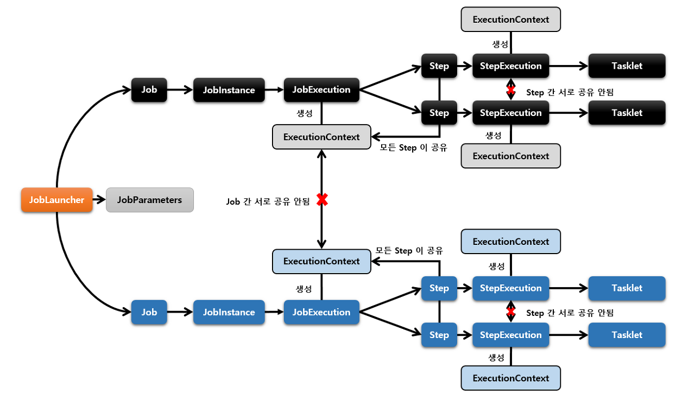

</details>

<details>
    <summary>JobRepository</summary>

- 위에서 설명한 모든 용어의 처리 정보와 배치 작업 정보를 저장하는 저장소.

  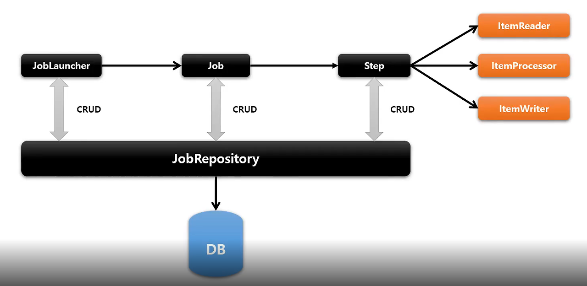

</details>

<details>
    <summary>JobLauncher</summary>

- Job과 JobParameter 인자를 받아 Job 실행하고 최종 Client에게 JobExecution 반환.
- 동기적 실행. (기본값으로 JobExecution 획득하고 배치 처리를 완료한 이후 Client에게 JobExecution 반환. 스케줄러 배치 처리에 적합.)
- 비동기적 실행. (TaskExecutor를 SimpleAsyncTaskExecutor로 설정. JobExecution 획득 후 바로 Client에게 JobExecution 반환. http 요청에 의한 배치처리에 적합.)

  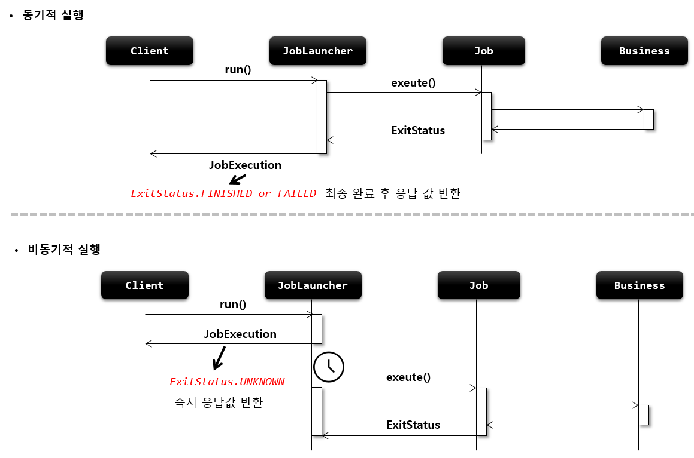

</details>

<details>
    <summary>ItemReader</summary>

- Step에서 Item 읽어오는 인터페이스.
- DB, File, XML, JSON, JMS(Java Message Service) 등 다양한 데이터 소스를 읽어오는 역할.
  - FlatFileItemReader (2차원 데이터로 표현된 유형의 파일 처리)
  - StaxEventItemReader (XML 유형 파일 처리)
  - JsonItemReader (JSON 유형 파일 처리)
  - 자세한 사항은 필요할 때 찾아보기 [링크](https://tonylim.tistory.com/434)
- Spring Batch에서 지원하지 않는 Reader가 필요할 경우 인터페이스를 활용하여 직접 만들 수 있음.
- Spring의 JdbcTemplate는 분할 처리를 지원하지 않으므로(기본적으로 select만 사용할 경우 조건에 맞는 모든 데이터를 가져오므로) 개발자가 직접 limit, offset 작업을 해주어야 함. 이를 해결하기 위한 방법으로 Cursor, Paging가 있음.(DB 처리 방식)
- Cursor
  - JDBC ResultSet 기본 메커니즘을 사용함. (ResultSet이 Open 될 때마다 next() 메소드가 호출되어 DB 데이터를 반환하는 형식)
  - Streaming 형식으로 데이터를 처리함.
  - DB와 커넥션을 맺은 경우 fetchSize 만큼 조회 후 메모리에 저장. 저장된 메모리에서 하나씩 읽아옴. (fetchSize가 없으면 select 구문이 여러번 돌아 비효율적. 단, 메모리 사용량이 증가함.)
  - DB와의 SocketTimeout을 충분히 큰 값으로 설정해야 함. (하나의 Connection으로 Batch가 끝날때까지 사용되기 때문에 중간에 연결이 끊길 수 있음. 따라서 오래 걸리는 Batch는 PagingItemReader를 사용하는게 더 나음.)
- Paging

  - 한번에 Page 단위로 데이터를 처리.
  - 한번에 설정한 Page Size 만큼 데이터를 읽어옴. (페이징 단위의 결과만 메모리에 할당하므로 메모리 사용량을 줄일 수 있음.)
  - 페이지를 읽을 때 마다 Connection을 맺고 끊음. (Connection 유지 시간이 길지 않을 때 사용.)
  - Spring Batch는 offset과 limit을 PageSize에 맞게 자동으로 생성해줌. 단, 쿼리는 개별적으로 실행함.
  - 각 페이지마다 새로운 쿼리를 실행하므로 페이징시 결과를 정렬하는 것이 중요함. 따라서, Order By 사용 권장됨.

  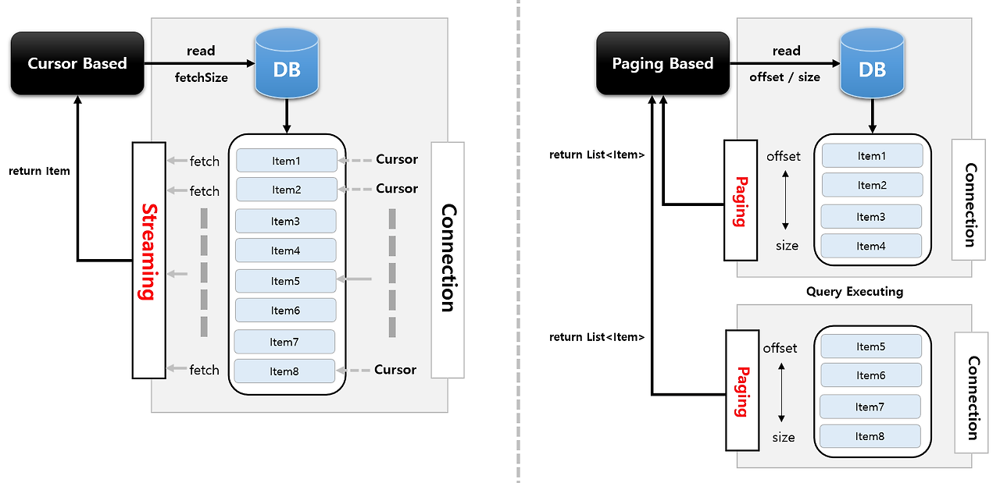

</details>

<details>
    <summary>ItemWriter</summary>

- DB, File, XML, JSON, JMS(Java Message Service) 등 다양한 형태로 데이터를 쓰는 역할.
  - FlatFileItemWriter (2차원 데이터 유형의 파일 처리)
  - StaxEventItemWriter (XML 유형 파일 처리)
  - JsonFileItemWriter (JSON 유형 파일 처리)
  - 자세한 사항은 필요할 때 찾아보기 [링크](https://tonylim.tistory.com/435)
- DB의 경우 ChunkSize 만큼 쌓아서 일괄 처리함.

</details>

<details>
    <summary>ItemProcessor</summary>

- Writer, Reader 사이에서 비즈니스 로직을 처리하는 역할.
- 필수는 아니며 비즈니스 로직을 따로 정리하기 위해 사용함.
- 주의점으로 repeatChunk 실습에서 java와 kotlin의 반복 출력 갯수가 다른데 이유는 다음과 같음.
  - List<String> 이 주어졌을때, ItemProcessor<String, String>은 List의 아이템 하나당 한번 실행되는 것이 아님. List<String> 하나를 받아 한번 실행되는 것임. List<String>의 아이템 하나 하나에 String::UpperCase 를 적용 후 전체 변환한 아이템들을 ItemProcessor로 리턴하는 것일뿐임. 즉, 아이템 하나하나에 적용을 하고 싶다면 코틀린 처럼 it->{} 을 사용하고 리턴해야함.

</details>

<details>
  <summary>ItemStream</summary>

- ItemReader와 ItemWriter 처리 과정 중 상태를 저장하고 오류가 발생하면 해당 상태를 참조하여 실패한 곳에서 재시작 하도록 지원함.
- ExecutionContext를 매개변수로 받아 상태 정보를 업데이트함.
- ItemReader, ItemWriter에서 ItemStream을 구현하고 있음.

</details>

<details>
    <summary>BatchStatus</summary>

- JobExecution과 StepExecution의 속성.
- Job과 Step의 종료 후 최종 결과 상태.
- COMPLETED, STARTING, STARTED, STOPPING, STOPPED, FAILED, ABANDONED, UNKNOWN.

</details>

<details>
    <summary>ExitStatus</summary>

- JobExecution과 StepExecution의 속성.
- Job과 Step의 실행 후 종료 되었을때의 상태.
- 기본적으로 BatchStatus와 동일한 값으로 설정함.
- UNKNOWN, EXECUTING, COMPLETED, NOOP, FAILED, STOPPED.

</details>

<details>
    <summary>FlowExecutionStatus</summary>

- FlowExecution의 속성.
- Flow 실행 후 최종 결과 상태.
- Flow 내 Step의 ExitStatus 값을 FlowExecutionStatus 값으로 저장.
- COMPLETED, STOPPED, FAILED, UNKNOWN.

</details>

<details>
    <summary>Scope</summary>

- 해당 어노테이션을 추가하면 해당 함수의 파라미터에 데이터 추가 가능.
- 해당 어노테이션을 사용하면 Bean의 생성 지점을 지정된 Scope가 실행 되는 시점으로 지연시킴.
- 장점
  - Bean 생성 지연을 통해 Application 실행되는 시점이 아닌 비즈니스 로직 처리 단계에서 Job Parameter를 할당 할 수 있음.
  - 동일한 컴포넌트 병렬 혹은 동시에 사용 시 유용함.
    - ex) 서로 다른 Step에서 하나의 Tasklet을 두고 마구잡이로 상태를 변경하는 것을 막을 수 있음.
- @JobScope
  - 해당 어노테이션과 @Bean을 사용하면 해당 컴포넌트 Job 실행 시점에 Spring Bean 생성함.
  - JobParameters, JobExecutionContext 사용 가능.
  - Step 선언문에 적용.
- @StepScope
  - 해당 어노테이션과 @Bean을 사용하면 해당 컴포넌트 Step 실행 시점에 Spring Bean으로 생성함.
  - JobParameters, JobExecutionContext, StepExecutionContext 사용 가능.
  - Tasklet, ItemReader, ItemWriter, ItemProcessor 선언문에 적용.

</details>

<br/>
<br/>

> ## 조건 별 흐름 제어 (Flow)

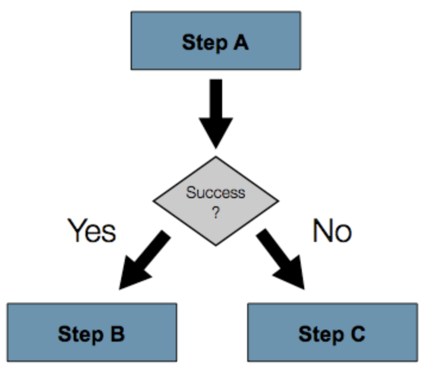

- Step을 순차적으로만 구성하는 것이 아닌 특정한 상태에 따라 흐름을 전환하도록 구성하는 것.
  - ex) Step이 실패하더라도 Job은 실패로 끝나지 않아야 하는 경우.
  - ex) Step이 성공했을 때 다음에 실행 해야 할 Step을 구분해서 실행해야 하는 경우.
  - ex) 특정 Step은 전혀 실행되지 않게 구성해야 하는 경우.
- Flow와 Job은 흐름을 구성하는데만 관여함. 실제 로직은 Step에서 구현함.
- 내부적으로 SimpleFlow 객체를 포함하고 있으며 Job 실행시 호출함.
- 분기 처리만 담당하는 JobExecutionDecider가 있음.
  - JobExecutionDecider를 상속 받는 클래스를 따로 만들어 분기 처리 로직을 분리함.

<br/>
<br/>

> ## Spring Batch Step 동작 방식

<details>
    <summary>Tasklet</summary>

- Step 단계에서 '단일 레코드', '파일' 등 하나의 작업만 처리하는 방식.
- 각각의 처리를 하나의 트랜잭션에서 처리함.
- 파일을 읽고 처리한 다음 결과를 데이터베이스에 쓰는 등의 작업을 수행함.
- 단일 작업으로 작업이 끝날 때까지 대기 해야함.
- 대용량 데이터 처리에 적합하지 않음.
- Step은 Tasklet 단위로 처리되고, Tasklet 중에서 ChunkOrientedTasklet을 통해 Chunk를 처리함.

</details>

<details>
    <summary>Chunk</summary>

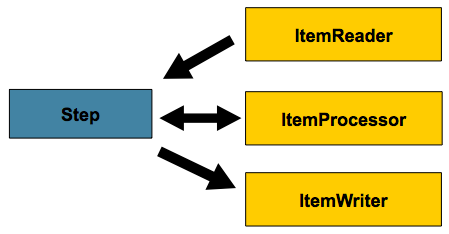
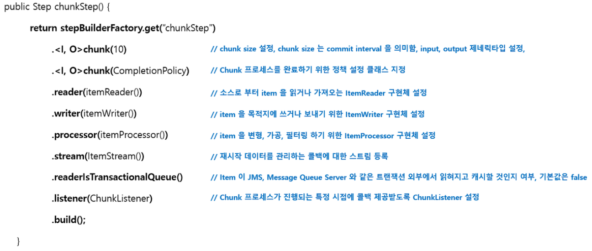

- Chunk: 데이터를 일정한 크기로 나눈 데이터 셋.
  - Chunk 단위로 나누면 전체 데이터를 한 번에 처리하지 않아도 되어 메모리 부하를 줄이고 성능을 향상시킬 수 있음.
- Step 단계에서 '단일 레코드를 묶어서' Chunk로 만들고 여러 Chunk 작업을 처리하는 방식.
- 묶인 레코드 Chunk를 각각 하나의 트랜잭션으로 처리하므로 실패시 해당 Chunk만 롤백.
- 병렬 처리를 위해 Chunk 사용하되, 순차적으로 처리하는 방식임.
- 대용량 데이터를 처리할 때 사용하며, 중복 처리나 실패한 레코드 처리 등 예외 상황에 대한 대처가 용이함.
- Reader로 하나의 데이터를 읽어옴.
- 읽어온 데이터를 Processor에서 가공.
- 가공된 데이터들을 별도의 공간에 Chunk 단위 만큼 모음.
- 다 쌓이면 Writer에 전달하고 Writer는 해당 데이터들을 일괄 저장함.
- Chunk Size vs Page Size
  - Chunk Size는 트랜잭션 범위를 설정하는 방법. 즉, 한 번에 처리할(커밋) 데이터의 수를 의미함.
  - Page Size는 처리할 데이터의 수를 설정하는 방법. 즉, 한 번에 몇개의 데이터를 처리할지 의미함.
  - 예를 들어, Chunk Size = 10, Page Size = 2 일 경우, Reader, Processor, Writer가 한번에 2개의 데이터 처리를 5번 반복하여 총 10개의 데이터를 처리해야 한번의 커밋이 발생함.
  - 따라서, 효과적인 성능 향상은 Page Size를 크게하고 해당 사이즈에 동일한 Chunk Size를 설정하여 대용량 처리 후 한번에 커밋하는 것이 좋음.
- PagingReader 주의사항
  - 페이징 처리 시 각 쿼리에 Offset, Limit를 지정해야함. 이때, 순서가 보장될 수 있도록 Order By를 사용해야 함.

</details>

<details>
    <summary>Parallel Chunk</summary>

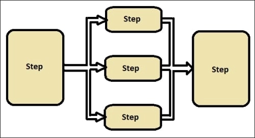

- Chunk 방식의 처리에서 더욱 빠른 처리 속도를 위해 Chunk를 독립적으로 처리하여 여러 개의 Chunk를 병렬로 처리 하는 방식.
- 여러 대의 서버에서 동시에 작업을 처리할 때 사용할 수 있음.

</details>

<details>
    <summary>Remote Chunking</summary>

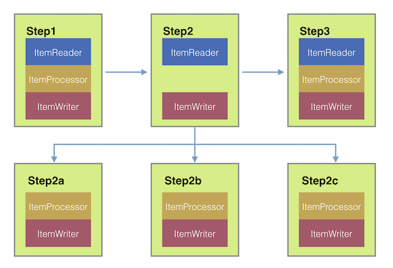

- 여러 대의 서버에서 대용량 데이터 처리를 수행할 때 사용함.
- 서버 간에 데이터를 공유하고 각 서버에서 병렬로 처리함.

</details>

<br/>
<br/>

> ## 반복 및 오류제어

<details>
  <summary>Repeat</summary>

- 작업을 얼마나 반복할지 제어할 수 있는 기능.
- 특정 조건이 충족 될 때까지 Step 또는 Chunk 반복하도록 설정 가능하며 RepeatOperation을 사용함. (step 반복은 실제 Step이 반복되는게 아닌 Step의 비즈니스 로직을 구현한 tasklet이 반복되는 것임.)
- 기본 구현체로 RepeatTemplate 제공.

  - RepeatStatus의 리턴 값에 따라 tasklet, chunk 반복 할지 정함.
  - RepeatStatus
    - 스프링배치의 처리가 끝났는지 판별하기 위한 열거형 (Enum)
    - CONTINUABLE(작업이 남아있음), FINISHED(더 이상의 반복 없음)
  - CompletionPolicy
    - RepeatTemplate의 iterate 메소드 안에서 반복을 중단할지 결정
    - 실행 횟수 또는 완료시기, 오류 발생시 수행할 작업에 대한 반복여부 결정
    - 정상 종료를 알리는데 사용됨.
  - ExceptionHandler
    - RepeatCallback 안에서 예외가 발생하면 RepeatTemplate가 ExceptionHandler 참조하여 예외를 다시 던질지 여부 결정함.
    - 예외를 받아 다시 던진다면 반복 종료.
    - 비정상 종료를 알리는데 사용됨.

  
  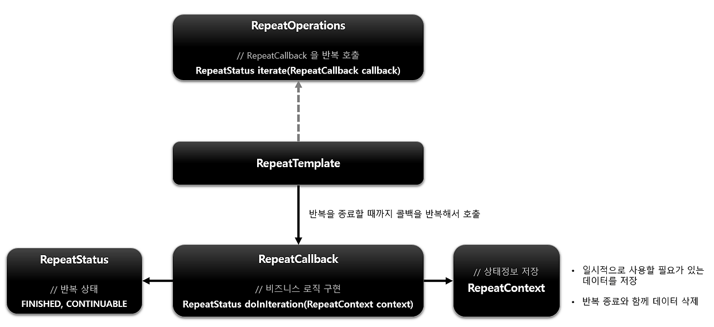
  
  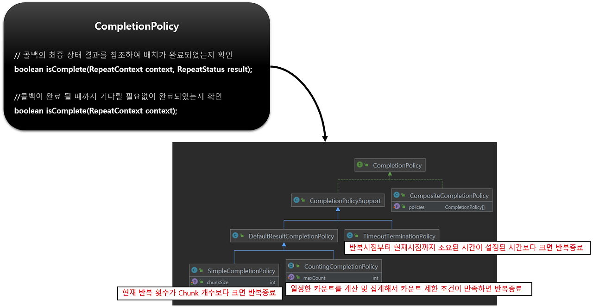
  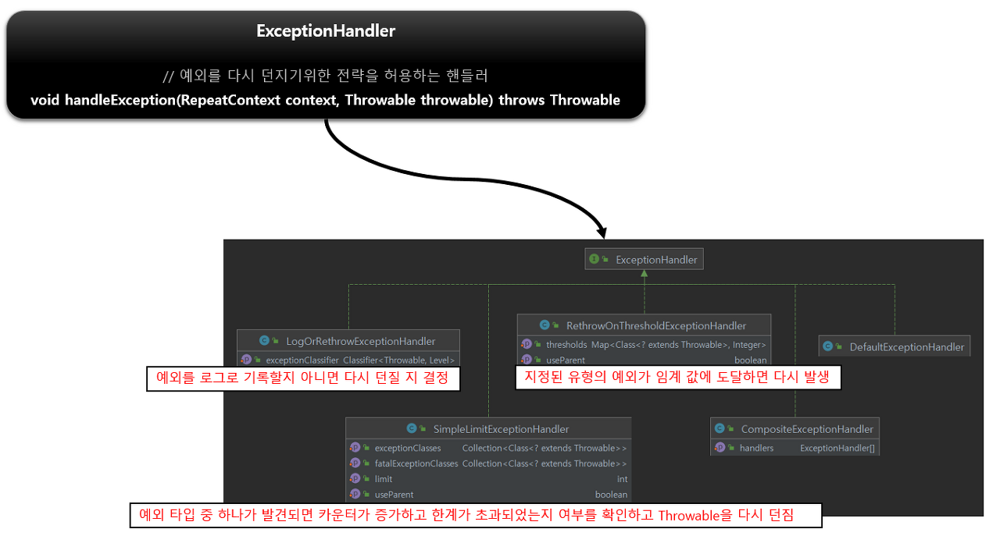

</details>

<details>
  <summary>FaultTolerant</summary>

- Job 실행 중 오류 발생 시 장애를 처리하기 위한 기능.
- 오류가 발생하면 Step이 즉시 종료되지 않고 Retry 혹은 Skip 기능을 활성화 하여 서비스가 돌아가도록 할 수 있음.
- FaultTolerant는 청크 기반의 포로세스 기반위에 Skip, Retry 기능이 추가되어 재정의 되어 있음.
</details>

<details>
  <summary>Skip</summary>

- ItemReader, ItemProcessor, ItemWriter 에서 적용 가능.
- 데이터를 처리하는 동안 설정된 Exception 발생한 경우, 해당 처리를 건너 뛰는 기능.
- 사소한 오류에 대해 Step 실패 처리 대신 Skip을 할 수 있음.
- 오류 발생 시 스킵 설정에 의해 Item2 건너뛰고 Item3부터 다시 처리.
- ItemReader는 예외가 발생하면 해당 아이템만 스킵하고 진행.
- ItemWriter, ItemProcessor에서 예외 발생 시 Chunk의 처음으로 돌아간 뒤 스킵된 아이템을 제외한 나머지 아이템들을 가지고 처리함.
- ItemReader가 캐싱을 해놓기 때문에 따로 io 작업 하지 않으며, processor는 캐싱된 것을 받은 뒤 item2 처리 때 skip함.
- ItemWriter도 ItemProcessor 캐싱 데이터를 가져와 예외 발생한 Item Skip.
- Skip 설정 시 횟수는 총 횟수임. 즉, Reader, Processor, Writer에서 일어난 모든 Skip 횟수가 넘으면 Exception 던지고 Batch 종료.

  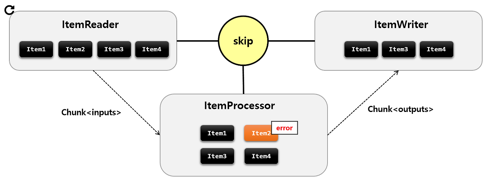

</details>

<details>
  <summary>Retry</summary>

- ItemProcessor, ItemWriter 에서 적용 가능. (두개만 RetryTemplate 안에서 돌기 때문.)
- 설정된 Exception 발생 시 데이터 처리를 재시도하는 기능.
- Reader는 retry 기능이 없다. 오류 발생 시 Chunk 단계의 처음부터 다시 시작함.
- 예외 발생 시 재시도 대상에 포함된 예외인지와 재시도 카운터를 체크해서 retry 결정함. 만약 retry 할 수 없다면 recoverCallback을 수행함.

  

</details>

<details>
  <summary>skip&retry</summary>

- 기본적으로 retry 후 skip.
- retry로 예외를 처리했다면 skip은 예외가 발생하지 않은 것이 되어 작동 x.
- retry 횟수가 초과되더라도 recover에서 어떻게 처리하는지에 따라 skip 작동 유무가 다름. (recover에서 예외를 처리해버릴 수도 있기 때문.)

  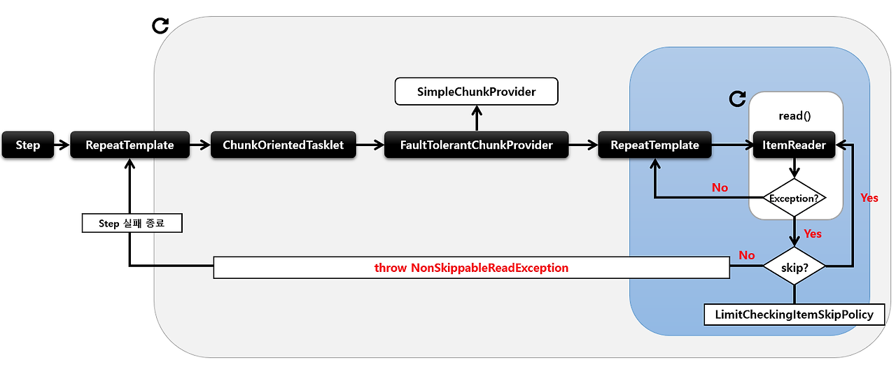
  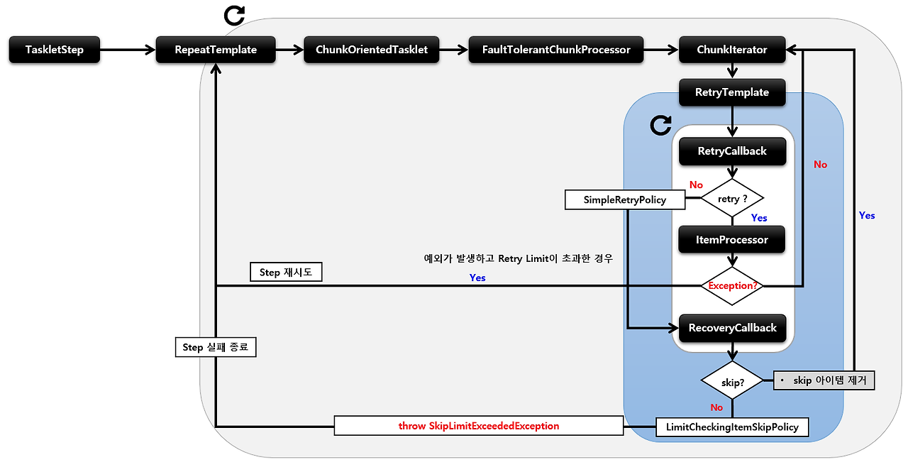
  

</details>

<br/>
<br/>

> ## 멀티 스레드 프로세싱

- 스프링 배치는 기본적으로 단일 스레드 방식임.
- 성능 향상과 대규모 데이터 작업을 위한 비동기 처리 및 Scale out 기능을 제공함.
- Local과 Remote 처리를 지원함.
- 여러 방식이 있음.
  <details>
    <summary>AsyncItemProcessor/AsyncItemWriter</summary>

  

  - step 안에서 해당 Processor/Writer에 별도의 스레드가 할당되어 비동기 동작하는 구조.
  - processor에서 리턴 값으로 List<Future<"T">> 반환.
  - writer는 processor에서 비동기 실행이 완료될 때까지 대기.
  - 주의할 점은 AsyncItem은 비동기 실행을 위한 박스이고 해당 로직 안에서 실제 실행하려는 Item을 SetDelegate() 해줘야 함.

  ```java
  @Bean
  public AsyncItemProcessor asyncItemProcessor() throws Exception {
      AsyncItemProcessor<Customer, Customer> asyncItemProcessor = new AsyncItemProcessor();

      asyncItemProcessor.setDelegate(customItemProcessor());
      asyncItemProcessor.setTaskExecutor(new SimpleAsyncTaskExecutor());
      // asyncItemProcessor.setTaskExecutor(taskExecutor());
      asyncItemProcessor.afterPropertiesSet();

      return asyncItemProcessor;
  }

  @Bean
  public AsyncItemWriter asyncItemWriter() throws Exception {
      AsyncItemWriter<Customer> asyncItemWriter = new AsyncItemWriter<>();

      asyncItemWriter.setDelegate(customItemWriter());
      asyncItemWriter.afterPropertiesSet();

      return asyncItemWriter;
  }

  ```

  </details>
  <details>
    <summary>Multi-threaded Step</summary>

  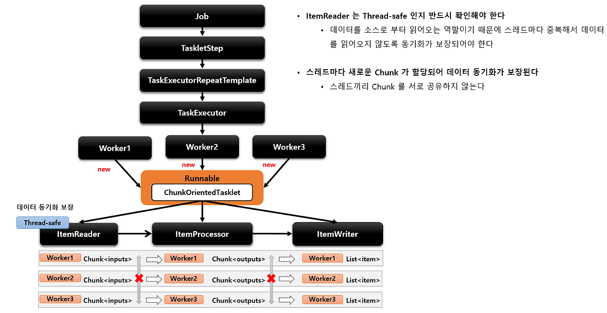

  - Step 내에서 멀티 스레드로 Chunk 기반 처리가 이루어는 방법.
  - TaskExecutorRepeatTemplate가 반복자로 사용되며 설정된 개수 만큼의 스레드를 생성하여 수행함.
  - 각각의 스레드가 독립적으로 수행되는데, ItemReader에서 충돌 방지를 위해 Thread-Safe 한 Reader만 사용해야 함.
  - JDBCPagingItemReader, JPAPagingItemReader는 Thread-Safe 함.
  - Thread-Safe 하지 않을 경우 동시성 오류가 발생함.

  </details>
  <details>
    <summary>Parallel Steps</summary>

  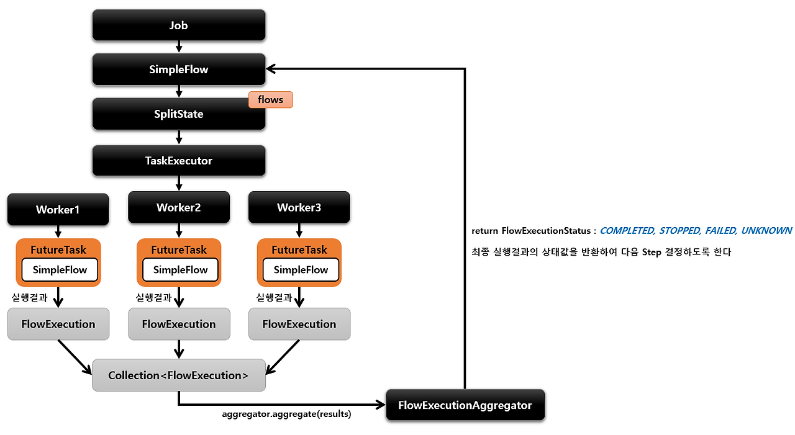

  - SplitState 사용해서 여러 개의 Flow를 병렬로 실행하는 구조.
  - FlowExecutionStatus에서 Flow 실행 완료 결과들을 취합하여 다음 단계로 넘어갈지 결정함.

  ```java
  @Bean
  public Job job() {
      return jobBuilderFactory.get("batchJob")
              .incrementer(new RunIdIncrementer())
              .start(flow1())
              .split(taskExecutor()).add(flow2(),flow3())
              .next(flow4())
              .end()
              .listener(new StopWatchJobListener())
              .build();
  }
  // flow1이 끝나면 flow2, flow3가 병렬 실행됨.
  // 2,3이 끝난 뒤 flow4가 실행됨.
  ```

  </details>
  <details>
    <summary>Partitioning</summary>

  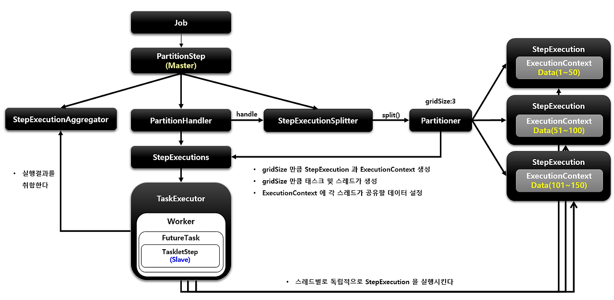
  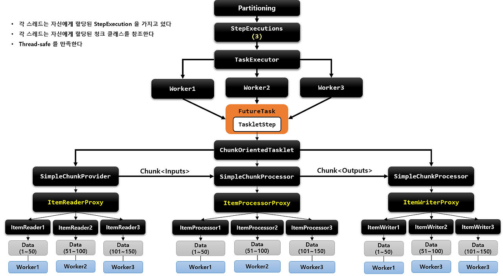

  - MasterStep이 SlaveStep 실행하는 구조.
  - SlaveStep은 각 스레드에 의해 독립적으로 실행되며, 독립적인 StepExecution 파라미터 환경을 구성함.
  - ItemReader, ItemProcessor, ItemWriter 등 비동기 설정이 되어 있어야 다른 step의 멀티 스레드가 동작한다는 것을 잊지 말자.
  - MasterStep = PartitionStep. 파티셔닝 기능을 수행하는 Step 구현체이며 파티셔닝 수행 후 StepExecutionAggregator를 사용해 각각의 StepExecution 정보를 최종 집계함.
  - PartitionHandler. PartitionStep에 의해 호출되며 스레드를 생성해 WorkStep을 병렬로 실행함. WorkStep에서 사용할 StepExecution 생성은 StepExecutionSplitter와 Partitioner에게 위임함. WorkStep을 병렬로 실행 후 최종 결과를 담은 StepExecution을 PartitionStep에 반환함.
  - StepExecutionSplitter. WorkStep에서 사용할 StepExecution을 gridSize 만큼 생성함. Partitioner를 통해 ExecutionContext를 얻어서 StepExecution에 매핑함.
  - Partitioner. StepExecution에 매핑할 ExecutionContext를 gridSize 만큼 생성함. 각 ExecutionContext에 저장된 정보는 WorkStep을 실행하는 스레드마다 독립적으로 참조 및 활용이 가능함.
  - 결국 Step을 실행시키기 위해 필요한 StepExecution, ExecutionContext를 만드는 과정임.

  </details>
  <details>
    <summary>SynchronizedItemStreamReader</summary>

  - Thread-Safe 하지 않은 ItemReader를 Thread-Safe 하게 처리하도록 만들어주는 역할
  - Spring Batch 4.0 부터 지원함.
  - AsyncItemProcessor의 구성과 비슷한 구성.

  ```java
  @Bean
  @StepScope
  public SynchronizedItemStreamReader<Customer> customItemReader() {
      JdbcCursorItemReader<Customer> notSafetyReader = new JdbcCursorItemReaderBuilder<Customer>()
              .fetchSize(60)
              .dataSource(dataSource)
              .rowMapper(new BeanPropertyRowMapper<>(Customer.class))
              .sql("select id, firstName, lastName, birthdate from customer")
              .name("SafetyReader")
              .build();

      return new SynchronizedItemStreamReaderBuilder<Customer>()
              .delegate(notSafetyReader)
              .build();
  }
  ```

<br/>
<br/>

> ## Listener

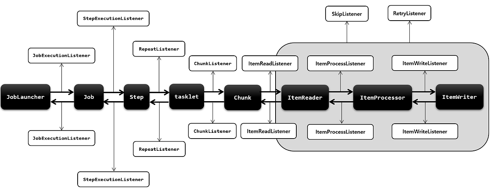

- Job, Step, Chunk 등 단계의 실행 전후에 발생하는 이벤트를 용도에 맞게 활용할 수 있도록 제공하는 인터셉터 개념의 클래스
- 각 단계별 로그 기록을 남기거나 소요된 시간을 계산하거나 실행 상태 정보들을 참조 및 조회 할 수 있음.
- API 설정에서 각 단계별로 지정 가능.
- 따로 상속 받는 클래스 없이 커스텀 클래스를 작성한 뒤, 메소드에 어노테이션을 추가하여 로직 생성. 이후 해당 클래스를 listener()로 셋팅해 사용함.
- SkipListener
  

  - 예외 발생할 때 각각 리스너 메소드를 통해 사용자가 지정한 작업 수행함.

- RetryListener
  

  - open: 재시도 전 매번 호출, false 반환 시 retry 시도 안함.
  - close: 재시도 후 매번 호출함.
  - onError: 재시도 실패시 마다 호출함.

<br/>
<br/>

> ## Scheduler

- Batch Job을 실행 시키기 위한 방법.
- Quartz, Scheduler, Jenkins 등이 있음.
- Spring에서 Quartz Scheduler 지원함.
