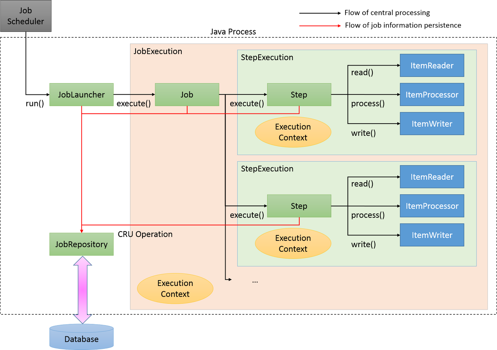

> ## Spring Batch란

- 일련의 작업을 정해진 로직으로 수행하는 것. (일괄처리)
- 대용량 레코드 처리에 필수적인 기능을 제공함.
  - ex) 로깅/추적, 트랜잭션 관리, 작업 처리 통계, 작업 재시작, 건너뛰기, 리소스 관리
- 최적화 및 파티셔닝 기술을 통해 대용량 및 고성능 배치작업을 가능하게 하는 고급 기술 서비스 및 기능 제공.
- 배치가 실패하여 작업 재시작할 경우 실패한 지점부터 실행함.
- 중복 실행을 막기 위해 성공 이력이 있는 배치는 동일한 파라미터로 실행 시 예외 발생함.
- Scheduler & Quartz -> Batch Job 실행 시키기 위한 용도.
- Spring Batch는 Scheduler가 아님. Batch Job 관리 용도.

 
 

> ## Spring Batch 구성

    
Job

- 배치 처리 과정을 하나의 단위로 만들어 놓은 객체.
- 배치 처리 과정에 있어 전체 계층 최상단에 위치.

    
JobInstance

- Job의 실행 단위.
- Job 실행 시 하나의 JobInstance 발생.

    
JobParameters

- JobInstance 구별 역할 및 JobInstance에 보내는 매개변수 역할.
- String, Double, Long, Date 4가지 형식만 지원함.

    
JobExecution

- JobInstance 실행 시 생기는 객체.
  - 실패한 Job을 재실행할 경우 새로운 객체가 생성됨.
- JobInstance 상태, 시작시간, 종료시간, 생성시간 등의 정보를 담고 있음.

    
Step

- Job의 배치처리를 정의하고 순차적인 단계를 캡슐화 한 것.
- 최소 1개의상의 step을 가져야하며 job의 실제 일괄 처리 제어하는 정보가 들어있음.

    
StepExecution

- Step 실행 시 새로운 StepExecution 객체 생성됨.
  - Job 하나에 여러 Step이 있을 때, 실패한 Step 이후의 Step은 실행 되지 않으므로 실패 이후의 Step은 StepExecution 생성 안됨.
- JobExecution에 저장되는 정보 외에 Read Count, Write Count, Commit Count, Skip Count 등의 정보를 담고 있음.

    
ExecutionContext

- 공유 데이터 저장소.
- JobExecutionContext, StepExecutionContext 2가지가 있음.
  - JobExecutionContext: Commit 시점에 데이터 저장.
  - StepExecutionContext: 실행 사이에 데이터 저장.

    
JobRepository

- 위에서 설명한 모든 용어의 처리 정보를 담고 있는 매커니즘.
- Job 실행 시 JobRepository에 JobExecution, StepExecution 생성하고 ExecutionContext 정보들을 저장, 조회, 사용할 수 있는 공간이 되어줌.

    
JobLauncher

- Job과 JobParameter 사용하여 Job 실행하는 객체.

    
ItemReader

- Step에서 Item 읽어오는 인터페이스.
- 다양한 인터페이스가 존재하며 다양한 방법으로 Item 읽어올 수 있음.

    
ItemWriter

- 처리 된 Data Write 할 때 사용함.
- 처기 결과에 따라 Insert, Update, Send가 될 수 있음.
- Read와 동일하게 다양한 인터페이스가 존재함.
- 기본적으로 Item을 Chunk로 묶어서 처리함.

    
ItemProcessor

- Reader에서 읽어온 Item 처리하는 역할.
- 배치를 처리하는데 필수 요소는 아님.

